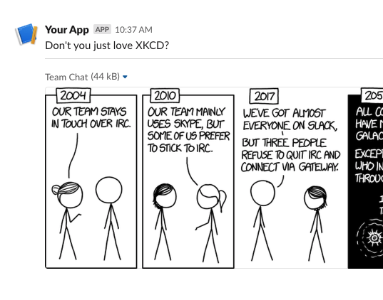

<header>
  <h1 align="center">Slack Block Kit for PHP</h1>
  <p align="center">:point_right: <em>For formatting messages and modals for Slack using their Block Kit syntax via an OOP interface</em> :point_left:</p>
  <p align="center">By Jeremy Lindblom (<a href="https://twitter.com/jeremeamia">@jeremeamia</a>)</p>
</header>

<p align="center">
  
</p>

<p align="center">
  <a href="http://php.net/">
    
  </a>
  <a href="https://packagist.org/packages/slack-php/slack-block-kit">
    
  </a>
  <a href="https://actions-badge.atrox.dev/slack-php/slack-php-block-kit/goto?ref=main">
    
  </a>
</p>

---

## Introduction

From Slack's [Block Kit documentation](https://api.slack.com/block-kit):

> **Block Kit** is a UI framework for Slack apps that offers a balance of control and flexibility when building
> experiences in messages and other _surfaces_.
> 
> Customize the order and appearance of information and guide users through your app's capabilities by composing,
> updating, sequencing, and stacking _blocks_ — reusable components that work almost everywhere in Slack.

This library provides an OOP interface in PHP for composing messages/modals using Slack Block Kit. It also does the
reverse, meaning you can "hydrate" message/modal JSON into an object hierarchy.

## Block Kit Concepts

This library helps you build Slack messages and modals programmatically and dynamically in your code, but you need to
know how they work generally first. The library does try to prevent you from doing things you are not permitted to do
in Block Kit, but it may not validate against every single or condition.

You may want to review the following concepts in the Slack documentation:

- [Surfaces](https://api.slack.com/surfaces) – There are 3 main types: Message, Modal, and App Home
- [Blocks](https://api.slack.com/reference/block-kit/blocks) – Includes _section_, _context_, _actions_, and more
- [Block Elements](https://api.slack.com/reference/block-kit/block-elements) – Includes buttons, menus, text inputs, and other interactive components. We call all of these "Elements" in this library.
- [Composition Objects](https://api.slack.com/reference/block-kit/composition-objects) – We call these "Parts" in the library

In general, we refer to ALL of these different things in Block Kit collectively as "components".

## Installation

Install easily via Composer:

```bash
composer require slack-php/slack-block-kit
```

Then include the Composer-generated autoloader in your project's initialization code.

**Note**: This library is built for PHP 8.1+.

_[Version 1](https://github.com/slack-php/slack-php-block-kit/tree/v1) of this library supports version 7.3/7.4._

## Basic Usage

This library supports an intuitive syntax for composing Slack surfaces (e.g., messages, modals) that utilizes PHP 8's 
named parameters feature.

```php
<?php

use SlackPhp\BlockKit\Surfaces\Message;
use SlackPhp\BlockKit\Blocks\Section;
use SlackPhp\BlockKit\Blocks\Divider;
use SlackPhp\BlockKit\Blocks\BlockImage;

// ...

// CONSTRUCTION
$msg = new Message(
    ephemeral: true,
    blocks: [
        new Section('Don\'t you just love XKCD?'),
        new Divider(),
        new BlockImage(
            title: 'Team Chat',
            imageUrl: 'https://imgs.xkcd.com/comics/team_chat.png',
            altText: 'Comic about the stubbornness of some people switching chat clients',
        ),
    ]
);

// VALIDATION
// Throws a ValidationException if any of the components are invalid or missing required properties.
$msg->validate();

// OUTPUT
// To convert to JSON (e.g., to send to Slack API, webhook, or response_url), use PHP's `json_encode()` function.
echo json_encode($msg);
// OR you can use the surfaces's `toJson()` method, which also includes a convenience parameter for pretty printing.
echo $msg->toJson(true);
// OR you can just convert to an array and do something else with the data.
print_r($msg->toArray());
```

### The `Kit` Façade

The `Kit` class acts as a façade for the whole library's set of components and has factory methods for each one. It
allows you to limit the number of classes you have to import to build a message (or other surface).

Each factory method has the same parameters as the original component's constructor.

```php
<?php

use SlackPhp\BlockKit\Kit;

// ...

$msg = Kit::message(
    ephemeral: true,
    blocks: [
        Kit::section('Don\'t you just love XKCD?'),
        Kit::divider(),
        Kit::blockImage(
            title: 'Team Chat',
            imageUrl: 'https://imgs.xkcd.com/comics/team_chat.png',
            altText: 'Comic about the stubbornness of some people switching chat clients',
        ),
    ]
);
```

### Fluent Interface

If named parameters aren't your jam, there is another way to set a component's properties, through the setter methods.
Each component has chainable setter methods for each of its properties, which allows for a fluent-style interface.

```php
$msg = Kit::message()
    ->ephemeral()
    ->blocks(
        Kit::section('Don\'t you just love XKCD?'),
        Kit::divider(),
        Kit::blockImage()
            ->title('Team Chat')
            ->imageUrl('https://imgs.xkcd.com/comics/team_chat.png')
            ->altText('Comic about the stubbornness of some people switching chat clients')
        ),
    );
```

The fluent syntax is not dependent on the `Kit` façade. Component classes have a static `new()` method that can be
used for chaining as well.

```php
$msg = Message::new()
    ->ephemeral()
    ->blocks(
        Section::new('Don\'t you just love XKCD?'),
        Divider::new(),
        BlockImage::new()
            ->title('Team Chat')
            ->imageUrl('https://imgs.xkcd.com/comics/team_chat.png')
            ->altText('Comic about the stubbornness of some people switching chat clients')
        ),
    );
```

#### Null Values

All properties are considered as null/empty until set.

You can also set a property explicitly to null to remove its value (e.g., from a component you created from existing data).

```php
$section->accessory(null);
```

Finally, null values are allowed in lists of blocks, elements, options, etc., so it's safe to use conditional items.

```php
$msg = Kit::message(
    blocks: [
        Kit::section('Don\'t you just love XKCD?'),
        ($includeDivider) ? Kit::divider() : null,
        Kit::blockImage(
            title: 'Team Chat',
            imageUrl: 'https://imgs.xkcd.com/comics/team_chat.png',
            altText: 'Comic about the stubbornness of some people switching chat clients',
        ),
    ]
);
```

### Preview in Block Kit Builder

Slack provides an [interactive Block Kit Builder](https://app.slack.com/block-kit-builder) for composing/testing
messages and other surfaces. This is a great way to play around with and learn the Block Kit format.

The `Kit::preview` method allows you to render your message/surface as a Block Kit Builder URL, so you can link to a
preview or your message/surface in the browser via their interactive tool. This will help you see how it would be
rendered in a Slack client.

```php
$msg = Kit::message(
    ephemeral: true,
    blocks: [
        Kit::section('Don\'t you just love XKCD?'),
        Kit::divider(),
        Kit::blockImage(
            title: 'Team Chat',
            imageUrl: 'https://imgs.xkcd.com/comics/team_chat.png',
            altText: 'Comic about the stubbornness of some people switching chat clients',
        ),
    ]
);

echo Kit::preview($msg);
```

#### Output

```
https://app.slack.com/block-kit-builder#%7B"blocks":%5B%7B"type":"section"%2C"text":%7B"type":"mrkdwn"%2C"text":"Don%27t%20you%20just%20love%20XKCD%3F"%7D%7D%2C%7B"type":"divider"%7D%2C%7B"type":"image"%2C"title":%7B"type":"plain_text"%2C"text":"Team%20Chat"%7D%2C"image_url":"https:%5C%2F%5C%2Fimgs.xkcd.com%5C%2Fcomics%5C%2Fteam_chat.png"%2C"alt_text":"Comic%20about%20the%20stubbornness%20of%20some%20people%20switching%20chat%20clients"%7D%5D%7D
```

And here's the [actual Block Kit Builder link](https://app.slack.com/block-kit-builder#%7B"blocks":%5B%7B"type":"section"%2C"text":%7B"type":"mrkdwn"%2C"text":"Don%27t%20you%20just%20love%20XKCD%3F"%7D%7D%2C%7B"type":"divider"%7D%2C%7B"type":"image"%2C"title":%7B"type":"plain_text"%2C"text":"Team%20Chat"%7D%2C"image_url":"https:%5C%2F%5C%2Fimgs.xkcd.com%5C%2Fcomics%5C%2Fteam_chat.png"%2C"alt_text":"Comic%20about%20the%20stubbornness%20of%20some%20people%20switching%20chat%20clients"%7D%5D%7D). 

It will show up in the Block Kit Builder looking something like this:



### Component Hydration

Some Slack application integrations (such as with Modals) require receiving the JSON of an existing surface and then 
modifying or replacing that surface with another. You can "hydrate" the JSON of a surface (or element) into its object
representation using its `fromArray` method (or `fromJson`).

```php
$messageJson = <<<JSON
{
    "blocks": [
        {
            "type": "section",
            "block_id": "block1",
            "text": {
                "type": "mrkdwn",
                "text": "*foo bar*"
            }
        }
    }
}
JSON;

// Use fromArray to hydrate the message from parsed JSON data.
$decodedMessageJson = json_decode($messageJson, true);
$message = Message::fromArray($decodedMessageJson);

// OR... use fromJson to hydrate from a JSON string.
$message = Message::fromJson($messageJson);
```

### Message Formatting

The `Md` class exists to provide helpers for formatting "mrkdwn" text. These helpers can be used so that you
don't have to have the Slack mrkdwn syntax memorized. Also, these functions will properly escape `<`, `>`, and `&`
characters automatically, if it's needed.

Example:
```php
// Note: $event is meant to represent some kind of DTO from your own application.
$md = Kit::md();
$msg = Kit::message(
    blocks: [
        Kit::section(
            text: $md->sub(
                'Hello, {audience}! On {date}, {host} will be hosting an AMA in the {channel} channel at {time}.',
                [
                    'audience' => $md->atHere(),
                    'date'     => $md->date($event->timestamp),
                    'host'     => $md->user($event->hostId),
                    'channel'  => $md->channel($event->channelId),
                    'time'     => $md->time($event->timestamp),
                ]
            )
        )
    ]
);
```

Example Result:
```json
{
  "blocks": [
    {
      "type": "section",
      "text": {
        "type": "mrkdwn",
        "text": "Hello, <!here>! On <!date^1608322949^{date}|2020-12-18T20:22:29+00:00>, <@U12345678> will be hosting an AMA in the <#C12345678> channel at <!date^1608322949^{time}|2020-12-18T20:22:29+00:00>."
      }
    }
  ]
}
```

## Virtual Blocks

In addition to the standard blocks, the following are virtual/custom blocks composed of one or
more other blocks:

* `TwoColumnTable` - Uses Sections with Fields to create a two-column table with an optional header.
* `CodeBlock` - Uses Sections to create a code block with an optional header.

## Class Structure

- `Surface`s, `Block`s, `Element`s, and `Part`s are all types of Block Kit `Component`s.
- The `Kit` façade can be used as a factory to create any `Component`.
- `Component`s contains properties and sub-`Component`s that define their appearance and behavior.
- `Part`s are repeated patterns that form the properties of other `Component`s.
- `Surface`s contain one or more `Block`s.
- `Block`s contain one or more `Element`s.
- Most `Element`s are interactive in some way.
- Many `Element`s are also `Input`s that receive user input.


<details>
<summary>See the YUML</summary>
<pre>
[Kit]-creates>[Component]
[Surface]^[Message]
[Surface]^[Modal]
[Surface]^[AppHome]
[Surface]^[Attachment]
[Component]^[Surface]
[Component]^[Block]
[Component]^[Element]
[Component]^[Part]
[Component]<>->[Part]
[Surface]<>->[Block]
[Message]<>->[Attachment]
[Block]<>->[Element]
[Element]^[Input]
[Element]-[note:Examples: Button, OverflowMenu {bg:cornsilk}]
[Input]-[note:Examples: Select Menu, DatePicker {bg:cornsilk}]
[Part]-[note: Examples: Text, Fields {bg:cornsilk}]
[Block]-[note: Examples: Section, Actions {bg:cornsilk}]
</pre>
</details>

### Contributions

Contributions welcome to support new elements, add tests, improve code, etc.
